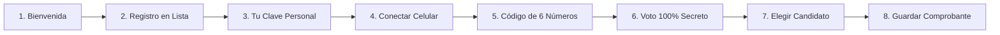

# Guía y Guión del Video Tutorial: Cómo Votar Paso a Paso

**Proyecto:** Elecciones Sindicales  
**Objetivo:** Explicar el proceso de votación de manera sencilla, rápida y sin términos técnicos complicados para todos los afiliados.  
**Formato sugerido:** Video tutorial 1080p (Full HD) / Formato Horizontal (16:9) y Vertical (9:16 para WhatsApp y redes).  
**Duración estimada:** ~2 minutos.

---

## 🎬 Estructura del Video (8 Pasos)

---

### 🕒 Paso 1: Bienvenido a las Elecciones
* **Duración:** 0:00 - 0:13 (13 segundos)
* **Texto en Pantalla:** *"Votación rápida, fácil y 100% secreta"*
* **Locución (Voz en Off):**
  > *"Bienvenido al sistema de votación del sindicato. Aquí podrás votar de forma muy fácil, rápida y totalmente segura. Tu voto es privado y nadie sabrá por quién votaste."*
* **Puntos Clave:**
  - Vota desde tu celular o computador.
  - Protegido con un código en tu teléfono.
  - Nadie sabrá por quién votaste: es 100% privado.

---

### 🕒 Paso 2: ¿No estás en la lista? Regístrate aquí
* **Duración:** 0:13 - 0:28 (15 segundos)
* **Texto en Pantalla:** *"Pide tu inscripción en menos de un minuto"*
* **Locución (Voz en Off):**
  > *"Si no apareces en la lista o necesitas actualizar tus datos, haz clic en '¿No figura en el censo?'. Llena tus datos básicos: cédula, nombre, correo, sede y teléfono. Al enviar, recibirás un número de radicado para hacerle seguimiento."*
* **Puntos Clave:**
  - Formulario sencillo con tus datos básicos.
  - Recibes tu número de radicado al instante.
  - El comité revisa y aprueba tu solicitud.

---

### 🕒 Paso 3: Ingreso y Creación de tu Clave
* **Duración:** 0:28 - 0:42 (14 segundos)
* **Texto en Pantalla:** *"Crea una clave personal que solo tú conozcas"*
* **Locución (Voz en Off):**
  > *"Ingresa con tu número de cédula y la clave inicial que te entregaron. La primera vez que entres, el sistema te pedirá crear una clave nueva y personal de mínimo 6 letras o números. Así tu cuenta queda totalmente protegida."*
* **Puntos Clave:**
  - Escribe tu cédula y clave inicial.
  - Crea tu clave nueva y personal.
  - Solo tú tendrás acceso a tu votación.

---

### 🕒 Paso 4: Conectar con tu Celular (Google Authenticator)
* **Duración:** 0:42 - 0:58 (16 segundos)
* **Texto en Pantalla:** *"Escanea el código con tu celular"*
* **Locución (Voz en Off):**
  > *"Para asegurar que nadie vote por ti, usaremos la aplicación Google Authenticator en tu celular. Descárgala gratis en tu teléfono, ábrela, toca el botón de más (+) y apunta la cámara al código en pantalla. Si no puedes escanearlo, también puedes escribir la clave manual."*
* **Puntos Clave:**
  - Descarga gratis la app en tu celular.
  - Apunta la cámara para leer el código.
  - También puedes copiar la clave si no tienes cámara.

---

### 🕒 Paso 5: Ingresa el Código de tu Celular
* **Duración:** 0:58 - 1:11 (13 segundos)
* **Texto en Pantalla:** *"Escribe los 6 números que aparecen en tu app"*
* **Locución (Voz en Off):**
  > *"La aplicación en tu celular te mostrará un código de 6 números que cambia cada 30 segundos. Escribe ese código en la pantalla y presiona 'Habilitar Voto'. Con esto confirmamos que realmente eres tú."*
* **Puntos Clave:**
  - Mira el código de 6 números en tu teléfono.
  - Escríbelo antes de que el círculo se llene.
  - Presiona 'Habilitar Voto' para ingresar a la cabina.

---

### 🕒 Paso 6: Tu Voto es 100% Secreto
* **Duración:** 1:11 - 1:26 (15 segundos)
* **Texto en Pantalla:** *"Tu nombre y cédula no se guardan con tu voto"*
* **Locución (Voz en Off):**
  > *"Aquí ocurre lo más importante: el sistema anota que ya participaste, pero entrega una papeleta digital totalmente anónima. Nadie puede saber por quién votaste, ni los directivos, ni los organizadores. Tu voto es completamente secreto."*
* **Puntos Clave:**
  - El sistema registra que ya participaste.
  - Tu cédula queda separada de tu papeleta.
  - Nadie sabrá cuál fue tu elección.

---

### 🕒 Paso 7: Elige tu Candidato y Vota
* **Duración:** 1:26 - 1:40 (14 segundos)
* **Texto en Pantalla:** *"Marca tu preferencia y deposita tu voto"*
* **Locución (Voz en Off):**
  > *"En la pantalla de votación verás a los candidatos y sus listas. Haz clic sobre el candidato de tu preferencia, presiona 'Continuar', revisa que todo esté bien y haz clic en 'Confirmar y Depositar'. Tu voto quedará guardado en la urna virtual."*
* **Puntos Clave:**
  - Mira las listas y candidatos disponibles.
  - Toca sobre el candidato que prefieras.
  - Confirma tu elección para depositar tu voto.

---

### 🕒 Paso 8: ¡Listo! Guarda tu Comprobante
* **Duración:** 1:40 - 1:54 (14 segundos)
* **Texto en Pantalla:** *"¡Voto registrado con éxito!"*
* **Locución (Voz en Off):**
  > *"¡Felicitaciones, ya votaste! La pantalla te mostrará un código de comprobante. Puedes copiarlo y guardarlo para comprobar que tu voto fue contado en el resultado final. ¡Gracias por participar!"*
* **Puntos Clave:**
  - Tu voto quedó guardado con éxito.
  - Recibes un código de comprobante único.
  - Cierra la sesión de forma tranquila y segura.

---

## 📱 Funcionalidades en la Aplicación Web

1. **Reproductor de Video Interactivo:**
   - Disponible en el botón **"🎥 Video Tutorial"** del encabezado y en la pantalla de inicio del votante.
   - Cuenta con voz natural en español y avance sincronizado automáticamente.
   - Incluye el simulador del teléfono celular con Google Authenticator en vivo.
2. **Pestaña Guía Rápida:**
   - Resumen en tarjetas ejecutivas con los 8 pasos claros para cualquier elector.
